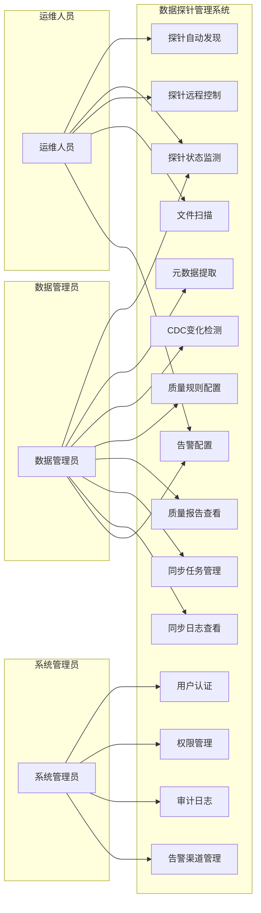
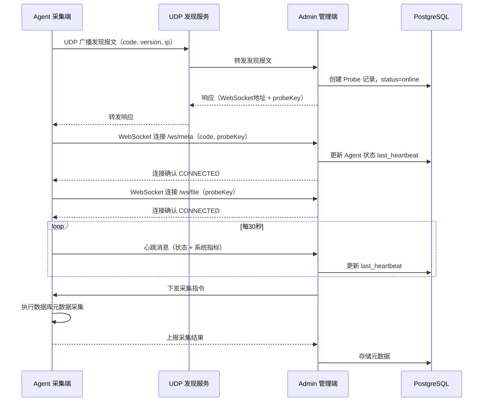
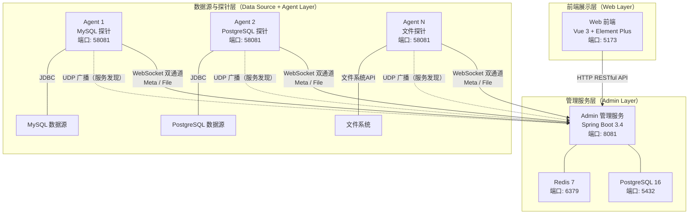
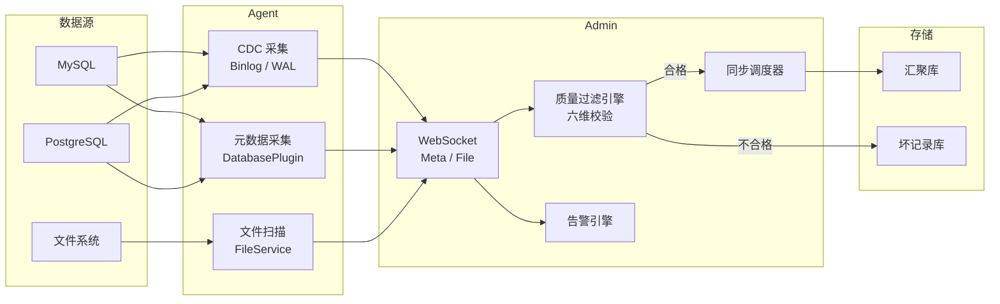
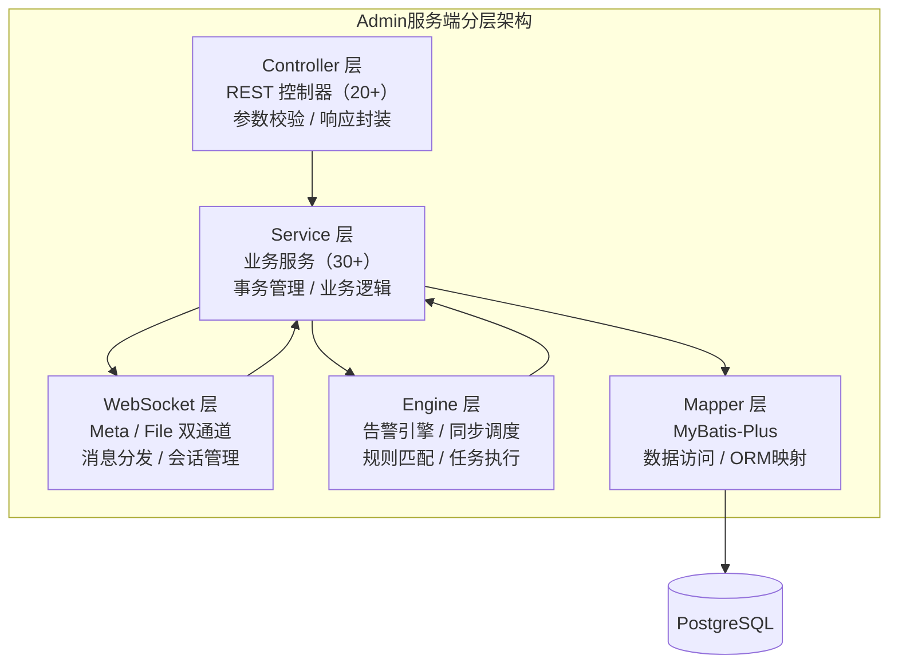
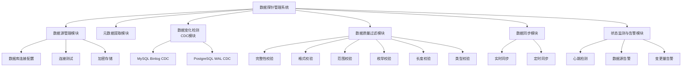
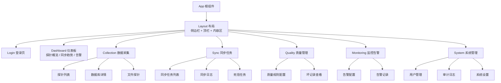

# 基于JavaWeb数据探针管理系统的设计与实现

**专业：计算机科学与技术    学号：201910914113**

**学生：李鑫    指导教师：易发胜**

---

**摘要：** 针对企业数据采集过程中存在的探针状态不可见、配置管理分散、数据质量难以保障等问题，本文设计并实现了一套基于JavaWeb的数据探针管理系统。系统采用管理端（Admin）与采集端（Agent）分离的分布式架构，管理端基于Spring Boot 3.4构建后端服务，使用PostgreSQL存储结构化数据，通过WebSocket双通道（Meta/File）实现与采集端的实时通信与指令下发；采集端作为轻量级守护进程部署在数据源侧，集成MySQL Binlog与PostgreSQL WAL的变更数据捕获（CDC）机制，实现行级数据变化的实时感知与上报。系统设计了插件式多数据库驱动架构，通过统一的DatabasePlugin接口支持MySQL、PostgreSQL、Oracle、SQL Server等九种以上异构数据源的无缝接入；构建了完整性、格式、范围、枚举、长度、类型六维数据质量过滤引擎，在数据汇聚前自动完成质量校验，不合格数据隔离至坏记录库。前端采用Vue 3与Element Plus构建可视化控制台，实现探针全生命周期管理、数据源监控、同步任务调度与告警通知等功能。系统经测试验证，能够稳定管理分布式数据探针的注册发现、状态监测与数据同步，解决了传统数据采集方案中"重采集、轻管理"的问题。

**关键词：** 数据探针；变更数据捕获；WebSocket；Spring Boot；数据质量管理

---

**Abstract:** Aiming at the problems of invisible probe status, scattered configuration management, and difficulty in ensuring data quality in enterprise data collection processes, this paper designs and implements a JavaWeb-based data probe management system. The system adopts a distributed architecture separating the management server (Admin) from the data collection agent (Agent). The Admin server is built on Spring Boot 3.4, using PostgreSQL for structured data storage and implementing real-time communication with agents via dual WebSocket channels (Meta/File) for command dispatching. The Agent, deployed as a lightweight daemon process at the data source side, integrates Change Data Capture (CDC) mechanisms based on MySQL Binlog and PostgreSQL WAL to achieve real-time row-level change detection and reporting. The system designs a plugin-based multi-database driver architecture that supports seamless integration of over nine heterogeneous data sources including MySQL, PostgreSQL, Oracle, and SQL Server through a unified DatabasePlugin interface. A six-dimensional data quality filtering engine covering completeness, format, range, enumeration, length, and type validation is constructed to automatically perform quality checks before data aggregation, with non-conforming data isolated into a dead letter store. The frontend adopts Vue 3 and Element Plus to build a visual console for probe lifecycle management, data source monitoring, synchronization task scheduling, and alert notifications. Testing verifies that the system can stably manage registration discovery, status monitoring, and data synchronization of distributed data probes, addressing the "heavy collection, light management" problem in traditional data collection approaches.

**Key words:** Data Probe; Change Data Capture; WebSocket; Spring Boot; Data Quality Management

---

## 目 录

- 1 绪论
  - 1.1 研究背景
  - 1.2 研究目的和意义
  - 1.3 国内研究现状
  - 1.4 国外研究现状
  - 1.5 研究内容
  - 1.6 可行性分析
- 2 相关技术介绍
  - 2.1 服务器端相关技术
  - 2.2 前端相关技术
  - 2.3 数据采集相关技术
  - 2.4 其他技术
- 3 系统需求分析
  - 3.1 系统概述
  - 3.2 功能需求分析
  - 3.3 非功能需求分析
  - 3.4 运行环境需求
  - 3.5 本章小结
- 4 系统设计
  - 4.1 系统架构设计
  - 4.2 功能模块设计
  - 4.3 安全设计
  - 4.4 本章小结
- 5 数据库设计
  - 5.1 概念模型设计
  - 5.2 物理模型设计
  - 5.3 本章小结
- 6 系统实现
  - 6.1 系统架构实现
  - 6.2 功能模块实现
  - 6.3 关键技术实现
  - 6.4 开发环境和运行环境
  - 6.5 本章小结
- 7 系统测试
  - 7.1 测试目的
  - 7.2 测试方法
  - 7.3 测试内容
  - 7.4 测试结论
  - 7.5 本章小结
- 结论与展望
  - 结论
  - 存在的问题与不足
  - 未来发展展望
- 参考文献
- 致谢

---

## 1 绪论

### 1.1 研究背景

在数字化转型的浪潮中，数据已成为驱动业务创新的核心要素。然而，在实际的数据生产环境中，数据源往往具有多源异构（关系数据库、文件系统、物联网设备等）、分布广泛且网络环境复杂的特点。传统的"脚本式"采集方式存在极大的局限性：采集程序通常是"一次性"的，缺乏状态感知，一旦运行失败难以察觉；且面对网络波动或数据量激增时，无法动态调整策略，容易造成数据丢失或服务器宕机[1]。

在此背景下，"数据探针"（Data Probe）的概念应运而生。本课题所定义的探针，并非简单的采集脚本，而是一种部署在数据源侧（Edge Side）的守护程序（Daemon Process）。它具备三大核心能力：（1）连接管理——长期驻留内存，稳定维持与数据库、文件系统的连接，并具备断线重连机制；（2）变化感知——通过监听日志（Binlog）、文件系统事件等机制，自动检测数据资源的变化并主动上报，实现增量感知；（3）按需提取——严格遵循管理端下发的策略指令，按要求精确提取特定字段或时段的数据，避免无效数据占用带宽。

尽管探针在技术上解决了数据采集问题，但作为一种长期运行在后台的守护程序，其在实际大规模部署中面临着严峻的治理挑战：（1）运行状态黑盒化——探针以无头模式（Headless）运行，运维人员无法直观感知其存活状态，一旦发生"假死"或"僵尸进程"，往往直到业务端数据断流才被发现；（2）配置版本漂移——面对成百上千的异构节点，依靠人工逐一修改采集规则极易出错；（3）资源竞争隐患——缺乏统一管控的探针极易在数据洪峰时抢占宿主机的CPU和内存，威胁核心业务的稳定性[2]。

随着探针数量的增加，如何高效管理这些分散在各个局域网角落的"神经末梢"，如何实现探针的自动发现、状态监控以及自适应的策略调度，成为亟待解决的技术难题。

### 1.2 研究目的和意义

#### 1.2.1 研究目的

本选题旨在设计并实现一套数据探针管理系统。该系统不直接处理庞大的业务数据流，而是作为控制中枢，专注于解决探针的"生存与调度"问题。目的在于构建一套标准化的管理框架，通过Web界面实现对局域网内数据探针的自动发现、远程配置、生命周期管理以及性能监控，同时实现数据变化检测、质量过滤与自动同步，保障数据采集的可靠性和数据质量。

#### 1.2.2 研究意义

（1）构建数据生态的"神经系统"。本系统明确了数据源、探针、管理系统之间的架构关系。探针作为执行端负责采集，管理系统作为控制端负责调度，两者分离的设计不仅降低了耦合度，更为上层的数据普查和溯源系统提供了稳定可靠的数据输入保障。

（2）提升运维自动化水平。通过引入UDP广播技术实现局域网自动发现功能，解决了传统模式下需人工逐一录入探针信息的痛点，极大降低了部署成本。

（3）保障数据质量与系统稳定性。系统的数据质量过滤引擎在数据汇聚前自动完成六维校验，有效拦截不合规数据；实时监控与告警机制确保了采集系统的稳定运行。

（4）实现后台服务的"白盒化"治理。通过JavaWeb可视化控制台，将原本黑盒运行的进程状态实时映射为可视化的心跳数据和监控指标，使运维模式从被动的"故障后救火"转变为主动的"预防式治理"[3]。

### 1.3 国内研究现状

在国内，随着工业互联网和大数据局的发展，华为、阿里等云厂商推出了各类边缘计算节点管理服务。这些商业产品虽然实现了云边协同，但通常封闭性较强，依赖特定的云生态，且价格昂贵，不适合中小型企业或特定内网环境下的定制化需求[6]。

目前，大多数企业在进行数据普查或资产盘点时，仍采用分散的脚本管理方式，缺乏统一的、可视化的探针全生命周期管理平台。虽然Flume、Filebeat等开源采集组件在数据传输性能上表现优异，但它们普遍存在"重采集、轻管理"的结构性偏差[7]。这些工具往往缺乏统一的图形化配置界面（GUI），在大规模集群管控、配置版本管理和可视化监控方面能力薄弱，无法满足企业对后台程序"可管可控"的运维诉求。

### 1.4 国外研究现状

在数据采集与集成领域，国外已有较为成熟的工具。Apache NiFi是一个强大的数据集成平台，支持可视化的数据流设计，提供丰富的数据源处理器，在大规模数据流处理上表现优异[4]。Logstash作为ELK技术栈的核心组件，擅长日志数据的采集与转换。Debezium是一个分布式平台，通过捕获数据库变更（CDC）实现数据流的实时处理[5]。然而，这些工具通常部署较重，资源消耗大，且更多侧重于"数据管道"的构建，对于分布在边缘端、资源受限环境下的轻量级探针管理支持较弱。

综上所述，开发一款轻量级且支持局域网自动发现的数据探针管理系统，既符合技术轻量化的发展趋势，也能解决当前数据治理中的实际痛点。

### 1.5 研究内容

本课题的主要研究内容包括以下四个方面：

（1）探针守护进程（Agent）的核心功能研发。开发一个轻量级、高可用的探针Agent程序，包含多源连接管理模块、变化感知与主动上报模块、策略驱动的数据提取模块三大核心模块。Agent通过插件式架构支持MySQL、PostgreSQL、Oracle、SQL Server、SQLite、达梦等多种异构数据库，并集成MySQL Binlog与PostgreSQL WAL的CDC机制实现实时变化感知。

（2）管理控制台（Admin）的设计与实现。基于Spring Boot构建后端管理服务，提供探针注册与发现、状态监测、数据源管理、元数据提取、数据质量过滤、同步任务调度、告警引擎等核心功能，通过WebSocket双通道与Agent实现实时通信。

（3）可视化前端（Web）的开发。基于Vue 3与Element Plus构建单页面应用（SPA），实现仪表板监控、探针管理、数据采集查看、同步任务管理、质量规则配置、告警监控与系统管理等功能页面。

（4）数据质量保障机制的设计。构建六维数据质量过滤引擎，在数据汇聚前自动完成完整性、格式、范围、枚举、长度、类型的校验，不合格数据隔离至坏记录库，保障入库数据质量。

### 1.6 可行性分析

#### 1.6.1 技术可行性

Spring Boot和Vue.js是成熟的主流开发框架，社区活跃、文档完善；WebSocket是标准的网络协议，广泛应用于实时通信场景；MySQL Binlog和PostgreSQL WAL是成熟的日志解析技术，已有开源实现（如mysql-binlog-connector-java、JDBC replication API）。UDP广播和插件化架构也是业界广泛验证的技术方案，技术风险可控[8]。

#### 1.6.2 经济可行性

系统采用全开源技术栈（Java、Spring Boot、Vue.js、PostgreSQL、Redis等），无商业软件授权成本。部署可采用Docker容器化方案，利用现有服务器资源即可完成，不增加额外的硬件投入。

#### 1.6.3 应用可行性

系统提供Web可视化控制台，操作界面简洁直观，运维人员通过浏览器即可管理分布在不同物理位置的探针。Docker Compose一键部署方案降低了安装门槛，适合中小型企业快速落地。

---

## 2 相关技术介绍

本章详细介绍数据探针管理系统所涉及的核心技术，按照服务器端技术、前端技术、数据采集技术和其他支撑技术四个类别进行说明。

### 2.1 服务器端相关技术

#### 2.1.1 Spring Boot框架

Spring Boot是由Pivotal团队开发的基于Spring框架的快速开发框架，其核心设计理念是"约定优于配置"[9]。Spring Boot通过自动配置（Auto-Configuration）机制，根据项目引入的依赖自动完成Spring应用的配置，开发者无需编写大量的XML配置文件即可快速搭建应用程序。

Spring Boot提供了内嵌Tomcat服务器、自动配置、起步依赖（Starter）等特性。常用模块包括spring-boot-starter-web提供RESTful API服务、spring-boot-starter-websocket实现WebSocket通信、spring-boot-starter-data-redis集成Redis缓存、spring-boot-starter-actuator提供应用健康监控等。Spring Boot 3.x基于Jakarta EE规范，要求Java 17及以上版本[10]。

#### 2.1.2 MyBatis-Plus

MyBatis-Plus是MyBatis的增强工具，在MyBatis的基础上只做增强不做改变，简化了开发流程[11]。其核心特性包括：通用CRUD操作（无需编写XML即可完成单表的增删改查）、条件构造器（Wrapper）提供类型安全的查询条件构建、分页插件支持多种数据库的分页查询。

通过继承BaseMapper接口可以快速实现各实体的数据访问层，配合PageHelper分页插件实现列表数据的分页查询。同时利用MyBatis-Plus的注解方式（如@TableName、@TableId）完成实体类与数据库表的映射关系定义。

#### 2.1.3 PostgreSQL数据库

PostgreSQL是一个功能强大的开源关系型数据库管理系统，以其高度的扩展性、标准兼容性和数据完整性保障而著称[12]。PostgreSQL支持丰富的数据类型（包括JSON/JSONB、数组、UUID等）、全文检索、地理空间数据处理等高级特性。

选用PostgreSQL作为管理端的持久化数据库，主要基于以下考虑：（1）PostgreSQL的WAL（Write-Ahead Logging）机制天然支持逻辑复制（Logical Replication），为CDC功能提供了底层支撑；（2）PostgreSQL对复杂查询和高并发的处理能力优于MySQL，适合管理系统多表关联查询的场景；（3）PostgreSQL的开源协议（PostgreSQL License）更加宽松，无商业使用限制。

#### 2.1.4 WebSocket协议

WebSocket是一种在单个TCP连接上进行全双工通信的协议，由IETF标准化（RFC 6455）[13]。与传统的HTTP请求-响应模式不同，WebSocket允许服务器主动向客户端推送数据，实现了真正的双向实时通信。

基于spring-boot-starter-websocket可构建实时通信通道。双通道设计（Meta通道和File通道）实现了业务隔离，避免了文件传输数据量大时影响控制指令的实时性。

#### 2.1.5 Spring WebSocket与Netty

Spring内置的WebSocket支持用于Admin端，Netty框架用于Agent端的UDP通信。Netty是一个基于Java NIO的高性能异步事件驱动网络框架[14]，可用于实现UDP广播的服务发现机制。

此外，Redisson（Redis的Java客户端）用于实现分布式锁和缓存管理，Bucket4j用于实现API限流，保障系统在高并发场景下的稳定性。

### 2.2 前端相关技术

#### 2.2.1 Vue 3框架

Vue.js是一个用于构建用户界面的渐进式JavaScript框架，Vue 3是其最新主要版本[15]。Vue 3基于Proxy实现了响应式系统，相比Vue 2的Object.defineProperty方案，在性能和功能上都有显著提升。Composition API（组合式API）是Vue 3引入的核心特性，允许开发者将组件的逻辑按功能组织而非按选项类型组织。

前端开发可利用ref和reactive实现响应式数据管理，通过组合式函数（Composables）模式封装通用逻辑（如useApiData、useWebSocket、useTheme等）。

#### 2.2.2 Element Plus组件库

Element Plus是Element UI的Vue 3版本，是由饿了么前端团队开源的一套桌面端组件库[16]。它提供了超过60个高质量UI组件，涵盖基础布局、表单、数据展示、导航、通知等场景。

#### 2.2.3 ECharts可视化

ECharts是百度团队开源的一个功能强大的数据可视化库[17]，支持折线图、柱状图、饼图、散点图、热力图、仪表盘等多种图表类型，并提供丰富的交互功能和动画效果。

#### 2.2.4 Axios与Vue Router

Axios是一个基于Promise的HTTP客户端，支持浏览器和Node.js环境[18]。配合自定义的请求/响应拦截器可实现JWT Token的自动附加和过期刷新机制。

Vue Router是Vue.js官方的路由管理器[19]，采用Hash模式路由，配合导航守卫（Navigation Guards）可实现基于角色的路由权限控制。

### 2.3 数据采集相关技术

#### 2.3.1 变更数据捕获（CDC）

变更数据捕获（Change Data Capture，CDC）是一种识别和捕获数据库中数据变更（INSERT、UPDATE、DELETE）的技术[20]。与传统的全量数据同步相比，CDC通过解析数据库的事务日志获取增量变更，具有对源库影响小、延迟低、数据完整等优势。

#### 2.3.2 MySQL Binlog

MySQL二进制日志（Binary Log，Binlog）记录了所有修改数据库数据的操作[21]。Binlog有三种格式：Statement（语句级）、Row（行级）和Mixed（混合级）。Row格式记录了每行数据的实际变更值，解析结果准确可靠。

mysql-binlog-connector-java库可用于实现Binlog的实时监听。建立Binlog连接后，实时接收并解析INSERT、UPDATE、DELETE事件，提取变更前后的数据快照。

#### 2.3.3 PostgreSQL WAL与逻辑复制

PostgreSQL的预写式日志（Write-Ahead Logging，WAL）是保障数据完整性和支持时间点恢复的核心机制[22]。PostgreSQL的逻辑复制（Logical Replication）功能基于WAL实现，允许以可读的格式获取数据变更。

通过JDBC的复制连接API（Replication API）创建逻辑复制槽（Replication Slot）和发布（Publication），订阅pgoutput协议的变更消息，实时解析INSERT、UPDATE、DELETE操作及对应的数据元组，实现行级变更的实时捕获。

### 2.4 其他技术

#### 2.4.1 Docker与Docker Compose

Docker是一个开源的应用容器引擎，通过操作系统级虚拟化实现应用的隔离运行[23]。Docker Compose是Docker官方的多容器编排工具，通过YAML文件定义和运行多个相关联的容器。

#### 2.4.2 JWT认证

JSON Web Token（JWT）是一种开放标准（RFC 7519），用于在各方之间安全地传输信息[24]。JWT由三部分组成：Header（头部）、Payload（载荷）和Signature（签名），通过数字签名确保信息的完整性和可信性。

#### 2.4.3 Redis缓存

Redis是一个基于内存的高性能键值存储系统[25]，支持字符串、哈希、列表、集合、有序集合等多种数据结构。

#### 2.4.4 OSHI系统监控库

OSHI（Operating System and Hardware Information）是一个免费的、基于JNA的操作系统和硬件信息获取库[26]，可用于采集宿主机的CPU使用率、内存占用、磁盘空间、网络流量等系统指标。

---

## 3 系统需求分析

### 3.1 系统概述

本系统是一个面向企业数据采集场景的探针管理系统，核心定位是将分散在各业务端、服务器、文件系统中的数据，通过探针自动采集、质量过滤、实时同步，统一汇聚到管理系统后端，实现集中查看、查询与管理，全程不影响原始数据源正常运行。

系统的核心参与者包括运维人员和数据管理员两类。运维人员负责部署探针Agent到各个数据源侧，通过Web控制台监控探针的运行状态，处理异常告警。数据管理员负责配置数据采集策略、定义数据质量规则、管理同步任务，以及查看汇聚后的数据。

系统采用B/S（Browser/Server）架构，运维人员通过浏览器即可完成所有管理操作。Agent以守护进程方式运行在数据源服务器上，无需图形界面。

### 3.2 功能需求分析

#### 3.2.1 目标用户分析

（1）运维人员：负责探针Agent的部署和日常运维，关注探针的存活状态、资源消耗、异常告警。倾向于通过仪表板快速了解系统全局状态，通过告警通知及时发现并处理问题。

（2）数据管理员：负责数据采集策略的配置和数据质量的管理，关注数据源的元数据信息、数据变化情况、同步任务执行状态。需要灵活的质量规则配置能力和丰富的数据查看功能。

（3）系统管理员：负责用户管理和系统配置，关注操作审计、权限控制和系统安全。需要完善的RBAC权限管理和审计日志功能。

#### 3.2.2 用例分析

系统用例图如图3.1所示。



<center>图3.1 系统用例图</center>

**（1）探针管理用例**

探针管理是系统的核心功能，主要用例包括：探针自动发现（Agent通过UDP广播被发现并自动注册）、探针状态监测（实时显示在线/离线状态和心跳信息）、探针远程控制（下发采集指令、触发扫描任务）、探针配置管理（查看和更新探针配置信息）。

**（2）数据采集用例**

数据采集功能包括：数据库元数据提取（自动获取库表结构信息）、数据变化检测（通过CDC实时感知数据变更）、文件扫描（递归扫描指定目录的文件信息）、数据库连接管理（管理多个数据库连接配置）、连接测试（验证数据库连接的可用性）。

**（3）数据质量用例**

数据质量管理包括：质量规则定义（配置完整性、格式、范围等校验规则）、质量扫描执行（对数据进行六维校验）、质量报告查看（查看校验结果和不合格记录）、坏记录管理（查看和处理不合格数据）。

**（4）数据同步用例**

数据同步功能包括：同步任务创建（配置源表、目标库和同步策略）、同步任务调度（支持实时同步和定时同步）、同步日志查看（查看每次同步的执行结果）、死信任务处理（查看和处理同步失败的任务）。

**（5）告警监控用例**

告警监控功能包括：数据源告警配置（设置数据源连通性告警规则）、数据变化告警配置（设置数据变更量告警规则）、告警渠道管理（配置邮件、Webhook等通知渠道）、告警记录查看（查看历史告警记录）。

**（6）系统管理用例**

系统管理功能包括：用户认证（登录/登出）、权限管理（基于角色的访问控制）、审计日志（记录所有管理操作）、系统设置（全局参数配置）。

#### 3.2.3 业务流程分析

**（1）探针注册与数据采集流程**

系统的核心业务流程如下：Agent启动后，首先通过UDP广播发送发现报文，Admin收到后自动创建探针记录并返回连接信息。Agent随后建立WebSocket连接（Meta通道和File通道），开始定期上报心跳和系统指标。当Admin下发采集指令时，Agent通过对应的数据库插件提取元数据，通过CDC机制监听数据变更，通过文件扫描服务采集文件信息。采集到的数据经过质量过滤后，通过同步任务汇聚到目标数据库。当检测到异常时，告警引擎触发告警并通知运维人员。

探针注册与通信的完整时序如图3.2所示。



<center>图3.2 探针注册与通信时序图</center>

**（2）数据同步流程**

数据同步支持两种模式：实时同步（CDC触发）和定时同步（Cron调度）。实时同步模式下，Agent检测到数据变更后立即上报，Admin接收后写入汇聚库；定时同步模式下，Admin按照预设的Cron表达式定期触发同步任务。同步前会自动执行质量过滤，不合格数据写入死信任务表。

### 3.3 非功能需求分析

#### 3.3.1 性能需求

系统需要满足以下性能指标：（1）探针心跳上报间隔不超过30秒，管理端应在5秒内感知探针状态变化；（2）WebSocket消息传输延迟不超过1秒；（3）数据库元数据采集响应时间不超过10秒（单库100张表以内）；（4）管理端支持同时管理不少于100个在线探针；（5）数据质量过滤处理速度不低于1000条/秒。

#### 3.3.2 安全需求

系统需要满足以下安全需求：（1）所有API接口需要JWT认证，未认证请求拒绝访问；（2）数据库密码等敏感信息加密存储，不得明文保存；（3）WebSocket连接需要通过认证密钥（probe.key）验证Agent身份；（4）关键操作（如删除探针、修改配置）需要记录审计日志；（5）API接口需要限流防护，防止暴力攻击。

#### 3.3.3 可用性需求

系统需要满足以下可用性需求：（1）Agent断线后应自动重连，重连采用指数退避策略；（2）Admin应提供健康检查接口（/actuator/health），支持外部监控；（3）系统应提供完善的日志记录，便于故障排查；（4）Docker部署方案应支持服务自动重启。

#### 3.3.4 可扩展性需求

系统需要满足以下可扩展性需求：（1）数据库驱动采用插件式架构，新增数据库类型只需实现DatabasePlugin接口；（2）告警渠道支持动态扩展，新增通知方式无需修改核心代码；（3）同步任务的目标类型支持扩展，可对接不同的存储后端。

### 3.4 运行环境需求

**开发环境：**
- 操作系统：Ubuntu 22.04 / Windows 10+
- JDK：OpenJDK 21
- Node.js：18+
- Maven：3.8+
- PostgreSQL：15+
- Redis：7+

**生产环境（Docker部署）：**
- Docker：24+
- Docker Compose：2.20+
- 最低硬件配置：4核CPU、8GB内存、50GB磁盘

**浏览器支持：**
- Google Chrome 90+
- Mozilla Firefox 90+
- Microsoft Edge 90+

### 3.5 本章小结

本章从系统概述出发，分析了三类目标用户（运维人员、数据管理员、系统管理员）的功能需求，通过用例分析明确了探针管理、数据采集、数据质量、数据同步、告警监控和系统管理六大核心功能。从性能、安全、可用性和可扩展性四个维度分析了非功能需求，并明确了开发和运行环境要求。

---

## 4 系统设计

### 4.1 系统架构设计

#### 4.1.1 总体架构设计

系统采用Admin-Agent分布式架构，分为三层：数据源与探针层、管理服务层、前端展示层。系统总体架构图如图4.1所示。



<center>图4.1 系统总体架构图</center>

数据源与探针层由部署在各数据源侧的Agent进程组成，负责数据库元数据采集、CDC变更捕获、文件扫描和系统指标收集。管理服务层由Admin服务组成，负责探针管理、数据汇聚、质量过滤、同步调度、告警引擎等核心业务。前端展示层由Vue 3 SPA应用组成，提供可视化的管理控制台。

三层之间的通信方式包括：Agent与Admin之间通过WebSocket实现双向实时通信，通过UDP实现服务发现；Web前端与Admin之间通过HTTP RESTful API进行数据交互；Agent与数据源之间通过JDBC进行数据库操作。

系统数据流图如图4.2所示，展示了从数据源采集到汇聚入库的完整流程。



<center>图4.2 系统数据流图</center>

#### 4.1.2 Admin服务端架构

Admin服务端采用经典的分层架构设计，如图4.3所示。



<center>图4.3 Admin分层架构图</center>

（1）Controller层：接收HTTP请求，负责参数校验和响应封装。包含AuthController（认证）、ProbeController（探针管理）、AgentController（Agent管理）、DatabaseConnectionController（数据库连接）、SyncTaskController（同步任务）、QualityRuleController（质量规则）、AlertChannelController（告警渠道）等20余个控制器。

（2）Service层：封装业务逻辑，提供事务管理。核心服务包括AgentService（Agent注册与管理）、ProbeControlService（探针控制）、ChangeDetectionService（变更检测）、AggregationService（数据汇聚）、SyncTaskService（同步调度）等30余个服务。

（3）WebSocket层：处理与Agent的双通道实时通信。包含MetaProbeWebSocketHandler（Meta通道处理器）、FileProbeWebSocketHandler（File通道处理器）、MessageDispatcher（消息分发器）等组件。

（4）Engine层：实现核心业务引擎。包含告警规则引擎（AlertNotifier）和同步调度引擎（SyncScheduler）。

（5）Mapper层：基于MyBatis-Plus的数据访问层，通过继承BaseMapper实现标准CRUD操作。

#### 4.1.3 Agent采集端架构

Agent采用模块化架构设计，核心模块包括：

（1）Plugin模块：插件式数据库驱动架构，通过DatabasePlugin接口定义统一的元数据采集、数据查询和CDC接入规范。目前实现了MySQL、PostgreSQL、Oracle、SQL Server、SQLite、达梦、Binlog CDC、PostgreSQL CDC共8个插件。

（2）WebSocket模块：负责与Admin的实时通信，包含ConnectionManager（连接管理）、ReconnectionPolicy（重连策略）、HeartbeatScheduler（心跳调度）、MessageHandler（消息处理）等组件。

（3）Collector模块：基于OSHI库采集CPU、内存、磁盘、网络等系统指标。

（4）Discovery模块：基于UDP广播的服务发现与自动注册。

（5）Config模块：多路径配置文件加载策略（JAR同级目录 → 工作目录 → classpath）。

（6）Sync模块：探针配置同步与本地缓存。

### 4.2 功能模块设计

系统功能模块图如图4.4所示。



<center>图4.4 系统功能模块图</center>

系统功能模块划分为六大模块：

**（1）数据源管理模块**

统一管理各类数据源，包括数据库连接配置和文件系统路径配置。支持加密存储数据库连接信息（用户名、密码），提供连接测试功能验证配置的正确性。数据源信息通过database-config.yml配置文件管理，Agent支持同时管理多个数据库实例。

**（2）元数据提取模块**

自动提取数据源的结构信息，包括数据库列表、表列表、字段定义、索引信息、外键约束等。对于文件系统，提取文件名、大小、修改时间、MD5校验值等属性。元数据采集不读取业务数据，仅获取结构信息。

**（3）数据变化检测（CDC）模块**

实时监听数据库变更，支持MySQL Binlog和PostgreSQL WAL两种CDC方案。捕获INSERT、UPDATE、DELETE三种操作类型，记录变更前后的数据快照。通过WebSocket实时上报变更事件至Admin。

**（4）数据质量过滤模块**

构建六维数据质量校验引擎：
- 完整性校验（Completeness）：检查字段是否为空或缺失
- 格式校验（Format）：使用正则表达式验证数据格式
- 范围校验（Range）：验证数值是否在指定区间内
- 枚举校验（Enumeration）：验证值是否在允许的枚举列表中
- 长度校验（Length）：验证字符串长度是否满足要求
- 类型校验（Type）：验证数据类型是否匹配预期

质量规则可按库、表、字段粒度配置，支持WARNING和ERROR两个严重级别。不合格数据自动隔离至坏记录库（dead_letter_task），可配置自动修复策略。

**（5）数据同步模块**

支持两种同步模式：
- 实时同步：CDC事件触发即时同步，延迟低
- 定时同步：通过Cron表达式配置调度策略

同步任务支持增量同步和全量同步两种方式，冲突策略支持UPSERT（存在则更新，不存在则插入）、SKIP（跳过）和OVERWRITE（覆盖）三种。同步执行日志详细记录每次同步的执行状态、处理行数和耗时。

**（6）状态监测与告警模块**

探针心跳检测每30秒上报一次，Admin判断超过5分钟未收到心跳则标记探针为离线。告警引擎支持数据源连通性告警（DataSourceAlert）和数据变化量告警（ChangeAlert），告警通知渠道支持Webhook等。

### 4.3 安全设计

#### 4.3.1 认证与授权

系统采用JWT + RBAC的认证授权方案。用户登录时，服务端验证用户名和密码，生成JWT令牌返回给前端。JWT令牌包含用户ID、角色和过期时间等信息，通过HMAC-SHA256签名确保安全性。前端在每次API请求中通过Authorization头部携带令牌，服务端的JwtAuthenticationFilter拦截器自动验证令牌有效性。

权限控制基于RBAC模型，定义了admin和user两种角色，admin角色拥有全部权限，user角色仅能查看数据。通过@RequiresPermission注解实现方法级别的权限控制。

#### 4.3.2 数据加密

数据库密码等敏感配置使用AES对称加密算法存储。加密密钥通过配置文件（config/security/encryption.properties）管理，Docker部署时通过环境变量注入。Agent与Admin之间的WebSocket通信支持消息级加密，通过CryptoUtil工具类实现消息的加解密。

#### 4.3.3 Agent认证

Agent连接Admin时需要提供认证密钥（probe.key），Admin的WebSocketOriginInterceptor拦截器验证连接来源的合法性，确保只有经过授权的Agent才能建立连接。

#### 4.3.4 API安全

系统通过Bucket4j实现API限流，防止暴力攻击。所有API接口均经过JWT认证，关键操作（删除探针、修改配置等）记录审计日志，包含操作人、操作时间、操作内容和IP地址。

### 4.4 本章小结

本章从系统架构设计出发，阐述了Admin-Agent分布式架构的三层设计和各层职责，通过系统总体架构图、数据流图和Admin分层架构图展示了系统的整体结构。详细设计了数据源管理、元数据提取、CDC变化检测、数据质量过滤、数据同步和状态监测告警六大功能模块。最后从认证授权、数据加密、Agent认证和API安全四个维度进行了安全设计。

---

## 5 数据库设计

### 5.1 概念模型设计

系统使用PostgreSQL 16作为主数据库，共设计35张数据表。系统的核心实体关系（ER）图如图5.1所示。

```mermaid
erDiagram
    PROBE ||--o{ CHANGE_LOG : "记录"
    PROBE ||--o{ DATA_SNAPSHOT : "快照"
    PROBE ||--o{ DATASOURCE_MONITOR_LOG : "监控"
    PROBE ||--o{ METRIC_DATA : "上报"
    PROBE ||--o{ DATABASE_METADATA : "关联"
    DATABASE_METADATA ||--o{ TABLE_INFO : "包含"
    TABLE_INFO ||--o{ COLUMN_INFO : "包含"
    TABLE_INFO ||--o{ CONSTRAINT_INFO : "约束"
    SYNC_TASK ||--o{ SYNC_LOG : "执行"
    SYNC_TASK ||--o{ DEAD_LETTER_TASK : "失败"
    QUALITY_RULE ||--o{ QUALITY_REPORT : "生成"
    PROBE ||--o{ FILE_METADATA : "扫描"
    PROBE ||--o{ FILE_SCAN_HISTORY : "记录"
    ALERT_CHANNEL ||--o{ DATASOURCE_ALERT_CONFIG : "通知"
    ALERT_CHANNEL ||--o{ CHANGE_ALERT_CONFIG : "通知"
    DATASOURCE_ALERT_CONFIG ||--o{ DATASOURCE_ALERT_RECORD : "触发"
    CHANGE_ALERT_CONFIG ||--o{ CHANGE_ALERT_RECORD : "触发"

    PROBE {
        bigint id PK
        varchar probe_key UK
        varchar name
        varchar type
        varchar status
        timestamp last_heartbeat
    }
    FILE_PROBE {
        bigint id PK
        varchar probe_key UK
        varchar name
        varchar status
        text scan_path
    }
    DATABASE_METADATA {
        bigint id PK
        varchar probe_key FK
        varchar database_type
        varchar database_name
    }
    TABLE_INFO {
        bigint id PK
        varchar probe_key FK
        varchar table_name
        bigint row_count
    }
    COLUMN_INFO {
        bigint id PK
        varchar table_name FK
        varchar column_name
        varchar data_type
    }
    CHANGE_LOG {
        bigint id PK
        varchar probe_key FK
        varchar table_name
        varchar change_type
        bigint affected_rows
    }
    SYNC_TASK {
        bigint id PK
        varchar task_name
        varchar source_probe_key FK
        varchar sync_mode
        boolean enabled
    }
    SYNC_LOG {
        bigint id PK
        bigint task_id FK
        varchar status
        bigint rows_processed
    }
    DEAD_LETTER_TASK {
        bigint id PK
        bigint task_id FK
        text original_data
        text failure_reason
    }
    QUALITY_RULE {
        bigint id PK
        varchar rule_name
        varchar table_name
        varchar rule_type
        varchar severity
    }
    QUALITY_REPORT {
        bigint id PK
        bigint rule_id FK
        bigint total_count
        bigint failed_count
    }
    ALERT_CHANNEL {
        bigint id PK
        varchar name
        varchar channel_type
        boolean enabled
    }
    DATASOURCE_ALERT_CONFIG {
        bigint id PK
        varchar probe_key
        varchar alert_type
        integer threshold
    }
    CHANGE_ALERT_CONFIG {
        bigint id PK
        varchar alert_name
        varchar probe_key
        varchar table_name
    }
    DATASOURCE_ALERT_RECORD {
        bigint id PK
        bigint config_id FK
        varchar alert_type
        varchar status
    }
    CHANGE_ALERT_RECORD {
        bigint id PK
        bigint alert_config_id FK
        varchar change_type
        varchar status
    }
```



<center>图5.1 系统核心实体关系（ER）图</center>

系统的核心实体包括：探针（Probe）、文件探针（FileProbe）、数据库连接（DatabaseConnection）、数据库元数据（DatabaseMetadata）、表信息（TableInfo）、列信息（ColumnInfo）、约束信息（ConstraintInfo）、变更日志（ChangeLog）、数据快照（DataSnapshot）、同步任务（SyncTask）、同步日志（SyncLog）、死信任务（DeadLetterTask）、质量规则（QualityRule）、质量报告（QualityReport）、告警渠道（AlertChannel）、数据源告警配置（DatasourceAlertConfig）、变更告警配置（ChangeAlertConfig）等。

实体之间的主要关系包括：一个Probe对应多条DatabaseMetadata和ChangeLog；一个DatabaseMetadata包含多条TableInfo；一条TableInfo包含多条ColumnInfo和ConstraintInfo；一个SyncTask产生多条SyncLog和DeadLetterTask；一条QualityRule生成多条QualityReport；一个AlertChannel关联多条DatasourceAlertConfig和ChangeAlertConfig。

### 5.2 物理模型设计

系统共设计35张数据表，按功能分为以下几组：

#### 5.2.1 探针管理表

**表5.1 probe（探针信息表）**

| 字段名 | 数据类型 | 约束 | 说明 |
|--------|---------|------|------|
| id | BIGINT | PRIMARY KEY, AUTO_INCREMENT | 主键ID |
| probe_key | VARCHAR(255) | UNIQUE, NOT NULL | 探针唯一标识 |
| name | VARCHAR(255) | NOT NULL | 探针名称 |
| type | VARCHAR(50) | NOT NULL | 探针类型 |
| status | VARCHAR(20) | NOT NULL, DEFAULT 'offline' | 状态（online/offline） |
| host_ip | VARCHAR(50) | | 主机IP地址 |
| port | INTEGER | | 端口号 |
| version | VARCHAR(50) | | 探针版本号 |
| config | TEXT | | 探针配置信息 |
| collect_interval | INTEGER | DEFAULT 60 | 采集间隔（秒） |
| running_status | VARCHAR(20) | DEFAULT 'stopped' | 运行状态 |
| running_status_updated_time | TIMESTAMP | | 运行状态更新时间 |
| last_heartbeat | TIMESTAMP | | 最后心跳时间 |
| create_time | TIMESTAMP | DEFAULT CURRENT_TIMESTAMP | 创建时间 |
| update_time | TIMESTAMP | DEFAULT CURRENT_TIMESTAMP | 更新时间 |

**表5.2 agent_log（Agent日志表）**

| 字段名 | 数据类型 | 约束 | 说明 |
|--------|---------|------|------|
| id | BIGSERIAL | PRIMARY KEY | 主键ID |
| agent_code | VARCHAR(100) | | Agent编码 |
| level | VARCHAR(20) | | 日志级别 |
| logger | VARCHAR(255) | | 日志记录器名称 |
| message | TEXT | | 日志消息 |
| exception_stack | TEXT | | 异常堆栈信息 |
| timestamp | TIMESTAMP | DEFAULT CURRENT_TIMESTAMP | 日志时间戳 |

**表5.3 agent_version（Agent版本表）**

| 字段名 | 数据类型 | 约束 | 说明 |
|--------|---------|------|------|
| id | BIGSERIAL | PRIMARY KEY | 主键ID |
| version | VARCHAR(50) | NOT NULL | 版本号 |
| file_path | VARCHAR(500) | | 文件路径 |
| file_size | BIGINT | | 文件大小 |
| checksum | VARCHAR(128) | | 校验和 |
| release_notes | TEXT | | 版本发布说明 |
| create_time | TIMESTAMP | DEFAULT CURRENT_TIMESTAMP | 创建时间 |
| uploaded_by | VARCHAR(100) | | 上传者 |

**表5.4 file_probe（文件探针表）**

| 字段名 | 数据类型 | 约束 | 说明 |
|--------|---------|------|------|
| id | BIGINT | PRIMARY KEY, AUTO_INCREMENT | 主键ID |
| probe_key | VARCHAR(255) | UNIQUE, NOT NULL | 探针唯一标识 |
| name | VARCHAR(255) | NOT NULL | 探针名称 |
| type | VARCHAR(32) | DEFAULT 'FILE' | 探针类型 |
| status | VARCHAR(32) | NOT NULL | 状态 |
| host_ip | VARCHAR(64) | NOT NULL | 主机IP地址 |
| port | INTEGER | | 端口号 |
| version | VARCHAR(32) | | 版本号 |
| scan_path | TEXT | NOT NULL | 扫描路径 |
| file_extensions | TEXT | | 文件扩展名过滤 |
| ignore_paths | TEXT | | 忽略路径 |
| scan_interval | INTEGER | DEFAULT 300 | 扫描间隔（秒） |
| max_depth | INTEGER | DEFAULT 10 | 最大递归深度 |
| total_file_count | BIGINT | DEFAULT 0 | 总文件数 |
| total_directory_count | BIGINT | DEFAULT 0 | 总目录数 |
| total_size | BIGINT | DEFAULT 0 | 总大小（字节） |
| last_scan_time | TIMESTAMP | | 最后扫描时间 |
| last_heartbeat | TIMESTAMP | | 最后心跳时间 |
| create_time | TIMESTAMP | DEFAULT CURRENT_TIMESTAMP | 创建时间 |
| update_time | TIMESTAMP | DEFAULT CURRENT_TIMESTAMP | 更新时间 |

**表5.5 metric_data（指标数据表）**

| 字段名 | 数据类型 | 约束 | 说明 |
|--------|---------|------|------|
| id | BIGINT | PRIMARY KEY, AUTO_INCREMENT | 主键ID |
| probe_id | BIGINT | | 探针ID |
| probe_key | VARCHAR(255) | | 探针标识 |
| metric_name | VARCHAR(255) | | 指标名称 |
| metric_value | DECIMAL(20,6) | | 指标值 |
| timestamp | TIMESTAMP | DEFAULT CURRENT_TIMESTAMP | 采集时间戳 |

#### 5.2.2 数据库元数据表

**表5.6 database_metadata（数据库元数据表）**

| 字段名 | 数据类型 | 约束 | 说明 |
|--------|---------|------|------|
| id | BIGINT | PRIMARY KEY, AUTO_INCREMENT | 主键ID |
| probe_key | VARCHAR(255) | NOT NULL | 探针标识 |
| database_type | VARCHAR(50) | | 数据库类型 |
| database_name | VARCHAR(255) | | 数据库名称 |
| version | VARCHAR(50) | | 数据库版本 |
| charset | VARCHAR(50) | | 字符集 |
| collation | VARCHAR(50) | | 排序规则 |
| url | VARCHAR(512) | | 连接URL |
| create_time | TIMESTAMP | DEFAULT CURRENT_TIMESTAMP | 创建时间 |
| update_time | TIMESTAMP | DEFAULT CURRENT_TIMESTAMP | 更新时间 |

**表5.7 table_info（表信息表）**

| 字段名 | 数据类型 | 约束 | 说明 |
|--------|---------|------|------|
| id | BIGINT | PRIMARY KEY, AUTO_INCREMENT | 主键ID |
| probe_key | VARCHAR(255) | NOT NULL | 探针标识 |
| table_name | VARCHAR(255) | NOT NULL | 表名 |
| engine | VARCHAR(50) | | 存储引擎 |
| row_count | BIGINT | | 行数 |
| data_size | BIGINT | | 数据大小 |
| index_size | BIGINT | | 索引大小 |
| total_size | BIGINT | | 总大小 |
| create_time_str | VARCHAR(50) | | 创建时间字符串 |
| update_time_str | VARCHAR(50) | | 更新时间字符串 |
| create_time | TIMESTAMP | DEFAULT CURRENT_TIMESTAMP | 创建时间 |
| update_time | TIMESTAMP | DEFAULT CURRENT_TIMESTAMP | 更新时间 |

**表5.8 column_info（列信息表）**

| 字段名 | 数据类型 | 约束 | 说明 |
|--------|---------|------|------|
| id | BIGINT | PRIMARY KEY, AUTO_INCREMENT | 主键ID |
| probe_key | VARCHAR(255) | NOT NULL | 探针标识 |
| table_name | VARCHAR(255) | NOT NULL | 表名 |
| column_name | VARCHAR(255) | NOT NULL | 列名 |
| data_type | VARCHAR(100) | | 数据类型 |
| column_type | VARCHAR(255) | | 列类型 |
| is_nullable | BOOLEAN | | 是否可空 |
| key_type | VARCHAR(20) | | 键类型 |
| default_value | VARCHAR(255) | | 默认值 |
| extra | VARCHAR(255) | | 附加信息 |
| comment | TEXT | | 注释 |
| create_time | TIMESTAMP | DEFAULT CURRENT_TIMESTAMP | 创建时间 |
| update_time | TIMESTAMP | DEFAULT CURRENT_TIMESTAMP | 更新时间 |

**表5.9 database_connection（数据库连接表）**

| 字段名 | 数据类型 | 约束 | 说明 |
|--------|---------|------|------|
| id | BIGSERIAL | PRIMARY KEY | 主键ID |
| name | VARCHAR(200) | | 连接名称 |
| database_type | VARCHAR(50) | NOT NULL | 数据库类型 |
| database_host | VARCHAR(200) | NOT NULL | 数据库主机 |
| database_port | INTEGER | NOT NULL | 数据库端口 |
| database_name | VARCHAR(200) | | 数据库名称 |
| username | VARCHAR(200) | | 用户名 |
| password | VARCHAR(500) | | 密码（加密存储） |
| schemas | TEXT | | Schema列表 |
| is_active | BOOLEAN | DEFAULT TRUE | 是否激活 |
| created_at | TIMESTAMP | DEFAULT CURRENT_TIMESTAMP | 创建时间 |
| updated_at | TIMESTAMP | DEFAULT CURRENT_TIMESTAMP | 更新时间 |

#### 5.2.3 数据变化检测表

**表5.10 change_log（变更日志表）**

| 字段名 | 数据类型 | 约束 | 说明 |
|--------|---------|------|------|
| id | BIGSERIAL | PRIMARY KEY | 主键ID |
| probe_key | VARCHAR(255) | NOT NULL | 探针标识 |
| database_name | VARCHAR(255) | | 数据库名称 |
| table_name | VARCHAR(255) | NOT NULL | 表名 |
| change_type | VARCHAR(30) | NOT NULL | 变更类型（INSERT/UPDATE/DELETE） |
| change_detail | TEXT | | 变更详情 |
| affected_rows | BIGINT | DEFAULT 0 | 影响行数 |
| before_data | TEXT | | 变更前数据 |
| after_data | TEXT | | 变更后数据 |
| operation | VARCHAR(20) | | 操作类型 |
| cdc_position | VARCHAR(200) | | CDC位点信息 |
| snapshot_before_id | BIGINT | | 变更前快照ID |
| snapshot_after_id | BIGINT | | 变更后快照ID |
| detected_time | TIMESTAMP | DEFAULT CURRENT_TIMESTAMP | 检测时间 |

**表5.11 data_snapshot（数据快照表）**

| 字段名 | 数据类型 | 约束 | 说明 |
|--------|---------|------|------|
| id | BIGSERIAL | PRIMARY KEY | 主键ID |
| probe_key | VARCHAR(255) | NOT NULL | 探针标识 |
| database_name | VARCHAR(255) | | 数据库名称 |
| table_name | VARCHAR(255) | NOT NULL | 表名 |
| row_count | BIGINT | | 行数 |
| data_size | BIGINT | | 数据大小 |
| index_size | BIGINT | | 索引大小 |
| data_checksum | VARCHAR(64) | | 数据校验和 |
| max_update_time | VARCHAR(100) | | 最大更新时间 |
| snapshot_time | TIMESTAMP | DEFAULT CURRENT_TIMESTAMP | 快照时间 |

**表5.12 datasource_monitor_log（数据源监控日志表）**

| 字段名 | 数据类型 | 约束 | 说明 |
|--------|---------|------|------|
| id | BIGINT | PRIMARY KEY, AUTO_INCREMENT | 主键ID |
| probe_key | VARCHAR(255) | NOT NULL | 探针标识 |
| metric_type | VARCHAR(50) | NOT NULL | 指标类型 |
| metric_value | DOUBLE | | 指标值 |
| metric_unit | VARCHAR(20) | | 指标单位 |
| extra_info | TEXT | | 附加信息 |
| collected_time | TIMESTAMP | DEFAULT CURRENT_TIMESTAMP | 采集时间 |

#### 5.2.4 数据同步与质量表

**表5.13 sync_task（同步任务表）**

| 字段名 | 数据类型 | 约束 | 说明 |
|--------|---------|------|------|
| id | BIGSERIAL | PRIMARY KEY | 主键ID |
| task_name | VARCHAR(200) | NOT NULL | 任务名称 |
| source_probe_key | VARCHAR(255) | NOT NULL | 源探针标识 |
| source_table_name | VARCHAR(255) | | 源表名 |
| target_type | VARCHAR(50) | NOT NULL | 目标类型 |
| target_config | TEXT | NOT NULL | 目标配置 |
| sync_mode | VARCHAR(20) | DEFAULT 'INCREMENTAL' | 同步模式 |
| cron_expression | VARCHAR(100) | | Cron表达式 |
| conflict_strategy | VARCHAR(20) | DEFAULT 'UPSERT' | 冲突策略 |
| last_sync_position | TEXT | | 最后同步位点 |
| last_sync_time | TIMESTAMP | | 最后同步时间 |
| last_sync_status | VARCHAR(20) | | 最后同步状态 |
| next_sync_time | TIMESTAMP | | 下次同步时间 |
| enabled | BOOLEAN | DEFAULT TRUE | 是否启用 |
| create_time | TIMESTAMP | DEFAULT CURRENT_TIMESTAMP | 创建时间 |
| update_time | TIMESTAMP | DEFAULT CURRENT_TIMESTAMP | 更新时间 |

**表5.14 sync_log（同步日志表）**

| 字段名 | 数据类型 | 约束 | 说明 |
|--------|---------|------|------|
| id | BIGSERIAL | PRIMARY KEY | 主键ID |
| task_id | BIGINT | NOT NULL | 任务ID |
| sync_mode | VARCHAR(20) | | 同步模式 |
| status | VARCHAR(20) | | 执行状态 |
| rows_processed | BIGINT | | 处理行数 |
| rows_succeeded | BIGINT | | 成功行数 |
| rows_failed | BIGINT | | 失败行数 |
| error_message | TEXT | | 错误信息 |
| start_time | TIMESTAMP | | 开始时间 |
| end_time | TIMESTAMP | | 结束时间 |
| create_time | TIMESTAMP | DEFAULT CURRENT_TIMESTAMP | 创建时间 |

**表5.15 dead_letter_task（死信任务表）**

| 字段名 | 数据类型 | 约束 | 说明 |
|--------|---------|------|------|
| id | BIGSERIAL | PRIMARY KEY | 主键ID |
| task_id | BIGINT | | 关联任务ID |
| original_data | TEXT | | 原始数据 |
| failure_reason | TEXT | | 失败原因 |
| retry_count | INTEGER | DEFAULT 0 | 重试次数 |
| status | VARCHAR(20) | | 状态 |
| create_time | TIMESTAMP | DEFAULT CURRENT_TIMESTAMP | 创建时间 |

**表5.16 quality_rule（质量规则表）**

| 字段名 | 数据类型 | 约束 | 说明 |
|--------|---------|------|------|
| id | BIGSERIAL | PRIMARY KEY | 主键ID |
| rule_name | VARCHAR(200) | NOT NULL | 规则名称 |
| probe_key | VARCHAR(255) | | 探针标识 |
| database_name | VARCHAR(255) | | 数据库名称 |
| table_name | VARCHAR(255) | | 表名 |
| column_name | VARCHAR(255) | | 列名 |
| rule_type | VARCHAR(50) | NOT NULL | 规则类型 |
| rule_params | TEXT | NOT NULL | 规则参数 |
| severity | VARCHAR(20) | DEFAULT 'WARNING' | 严重级别 |
| enabled | BOOLEAN | DEFAULT TRUE | 是否启用 |
| auto_fix | BOOLEAN | DEFAULT FALSE | 是否自动修复 |
| fix_action | VARCHAR(50) | | 修复动作 |
| fix_params | TEXT | | 修复参数 |
| create_time | TIMESTAMP | DEFAULT CURRENT_TIMESTAMP | 创建时间 |
| update_time | TIMESTAMP | DEFAULT CURRENT_TIMESTAMP | 更新时间 |

**表5.17 quality_report（质量报告表）**

| 字段名 | 数据类型 | 约束 | 说明 |
|--------|---------|------|------|
| id | BIGSERIAL | PRIMARY KEY | 主键ID |
| rule_id | BIGINT | | 关联规则ID |
| probe_key | VARCHAR(255) | | 探针标识 |
| database_name | VARCHAR(255) | | 数据库名称 |
| table_name | VARCHAR(255) | | 表名 |
| total_count | BIGINT | | 总记录数 |
| failed_count | BIGINT | | 不合格记录数 |
| pass_rate | DECIMAL(5,2) | | 合格率（百分比） |
| check_time | TIMESTAMP | DEFAULT CURRENT_TIMESTAMP | 检查时间 |

**表5.18 quality_scan_log（质量扫描日志表）**

| 字段名 | 数据类型 | 约束 | 说明 |
|--------|---------|------|------|
| id | BIGSERIAL | PRIMARY KEY | 主键ID |
| scan_id | VARCHAR(100) | | 扫描批次ID |
| probe_key | VARCHAR(255) | | 探针标识 |
| table_name | VARCHAR(255) | | 表名 |
| scan_status | VARCHAR(20) | | 扫描状态 |
| total_rows | BIGINT | | 总行数 |
| failed_rows | BIGINT | | 不合格行数 |
| start_time | TIMESTAMP | | 开始时间 |
| end_time | TIMESTAMP | | 结束时间 |

#### 5.2.5 告警与监控表

**表5.19 alert_channel（告警渠道表）**

| 字段名 | 数据类型 | 约束 | 说明 |
|--------|---------|------|------|
| id | BIGSERIAL | PRIMARY KEY | 主键ID |
| name | VARCHAR(200) | NOT NULL | 渠道名称 |
| channel_type | VARCHAR(30) | NOT NULL | 渠道类型（WEBHOOK等） |
| config | TEXT | | 渠道配置 |
| enabled | BOOLEAN | DEFAULT TRUE | 是否启用 |
| create_time | TIMESTAMP | DEFAULT CURRENT_TIMESTAMP | 创建时间 |
| update_time | TIMESTAMP | DEFAULT CURRENT_TIMESTAMP | 更新时间 |

**表5.20 datasource_alert_config（数据源告警配置表）**

| 字段名 | 数据类型 | 约束 | 说明 |
|--------|---------|------|------|
| id | BIGSERIAL | PRIMARY KEY | 主键ID |
| probe_key | VARCHAR(255) | | 探针标识 |
| alert_type | VARCHAR(50) | NOT NULL | 告警类型 |
| threshold | INTEGER | | 告警阈值 |
| enabled | BOOLEAN | DEFAULT TRUE | 是否启用 |
| create_time | TIMESTAMP | DEFAULT CURRENT_TIMESTAMP | 创建时间 |
| update_time | TIMESTAMP | DEFAULT CURRENT_TIMESTAMP | 更新时间 |

**表5.21 datasource_alert_record（数据源告警记录表）**

| 字段名 | 数据类型 | 约束 | 说明 |
|--------|---------|------|------|
| id | BIGSERIAL | PRIMARY KEY | 主键ID |
| config_id | BIGINT | | 关联配置ID |
| probe_key | VARCHAR(255) | NOT NULL | 探针标识 |
| alert_type | VARCHAR(50) | | 告警类型 |
| alert_message | TEXT | | 告警消息 |
| status | VARCHAR(20) | DEFAULT 'PENDING' | 状态 |
| create_time | TIMESTAMP | DEFAULT CURRENT_TIMESTAMP | 创建时间 |
| resolved_time | TIMESTAMP | | 解决时间 |

**表5.22 change_alert_config（变更告警配置表）**

| 字段名 | 数据类型 | 约束 | 说明 |
|--------|---------|------|------|
| id | BIGSERIAL | PRIMARY KEY | 主键ID |
| alert_name | VARCHAR(200) | NOT NULL | 告警名称 |
| probe_key | VARCHAR(255) | | 探针标识 |
| table_name | VARCHAR(255) | | 表名 |
| change_types | VARCHAR(255) | | 变更类型列表 |
| threshold_rows | BIGINT | DEFAULT 100 | 阈值行数 |
| alert_level | VARCHAR(20) | DEFAULT 'WARNING' | 告警级别 |
| notify_channels | VARCHAR(100) | DEFAULT 'LOG' | 通知渠道 |
| enabled | BOOLEAN | DEFAULT TRUE | 是否启用 |
| create_time | TIMESTAMP | DEFAULT CURRENT_TIMESTAMP | 创建时间 |

**表5.23 change_alert_record（变更告警记录表）**

| 字段名 | 数据类型 | 约束 | 说明 |
|--------|---------|------|------|
| id | BIGSERIAL | PRIMARY KEY | 主键ID |
| alert_config_id | BIGINT | | 关联告警配置ID |
| probe_key | VARCHAR(255) | NOT NULL | 探针标识 |
| table_name | VARCHAR(255) | | 表名 |
| change_type | VARCHAR(30) | | 变更类型 |
| change_detail | TEXT | | 变更详情 |
| affected_rows | BIGINT | | 影响行数 |
| alert_level | VARCHAR(20) | | 告警级别 |
| notify_channel | VARCHAR(100) | | 通知渠道 |
| status | VARCHAR(20) | DEFAULT 'PENDING' | 状态 |
| created_time | TIMESTAMP | DEFAULT CURRENT_TIMESTAMP | 创建时间 |
| resolved_time | TIMESTAMP | | 解决时间 |

#### 5.2.6 系统管理表

**表5.24 audit_log（审计日志表）**

| 字段名 | 数据类型 | 约束 | 说明 |
|--------|---------|------|------|
| id | BIGINT | PRIMARY KEY, AUTO_INCREMENT | 主键ID |
| user_id | VARCHAR(100) | | 操作用户ID |
| username | VARCHAR(100) | | 操作用户名 |
| operation | VARCHAR(50) | | 操作类型 |
| module | VARCHAR(50) | | 功能模块 |
| resource_type | VARCHAR(50) | | 资源类型 |
| resource_id | VARCHAR(100) | | 资源ID |
| details | TEXT | | 操作详情 |
| ip_address | VARCHAR(50) | | IP地址 |
| user_agent | VARCHAR(255) | | 用户代理 |
| status | VARCHAR(20) | | 操作状态 |
| error_message | TEXT | | 错误信息 |
| level | VARCHAR(20) | DEFAULT 'INFO' | 日志级别 |
| business_id | BIGINT | | 业务ID |
| business_type | VARCHAR(100) | | 业务类型 |
| response_message | TEXT | | 响应消息 |
| is_exception | BOOLEAN | DEFAULT FALSE | 是否异常 |
| exception_message | TEXT | | 异常消息 |
| is_archived | BOOLEAN | DEFAULT FALSE | 是否已归档 |
| archive_time | TIMESTAMP | | 归档时间 |
| create_time | TIMESTAMP | DEFAULT CURRENT_TIMESTAMP | 创建时间 |

**表5.25 settings（系统设置表）**

| 字段名 | 数据类型 | 约束 | 说明 |
|--------|---------|------|------|
| id | BIGSERIAL | PRIMARY KEY | 主键ID |
| setting_key | VARCHAR(200) | UNIQUE, NOT NULL | 设置键名 |
| setting_value | TEXT | | 设置值 |
| description | TEXT | | 设置说明 |
| create_time | TIMESTAMP | DEFAULT CURRENT_TIMESTAMP | 创建时间 |
| update_time | TIMESTAMP | DEFAULT CURRENT_TIMESTAMP | 更新时间 |

**表5.26 webhook_config（Webhook配置表）**

| 字段名 | 数据类型 | 约束 | 说明 |
|--------|---------|------|------|
| id | BIGSERIAL | PRIMARY KEY | 主键ID |
| name | VARCHAR(200) | NOT NULL | Webhook名称 |
| url | VARCHAR(500) | NOT NULL | 回调URL |
| secret | VARCHAR(255) | | 签名密钥 |
| events | TEXT | | 订阅事件列表 |
| enabled | BOOLEAN | DEFAULT TRUE | 是否启用 |
| create_time | TIMESTAMP | DEFAULT CURRENT_TIMESTAMP | 创建时间 |
| update_time | TIMESTAMP | DEFAULT CURRENT_TIMESTAMP | 更新时间 |

**表5.27 file_metadata（文件元数据表）**

| 字段名 | 数据类型 | 约束 | 说明 |
|--------|---------|------|------|
| id | BIGSERIAL | PRIMARY KEY | 主键ID |
| probe_key | VARCHAR(255) | | 探针标识 |
| file_name | VARCHAR(500) | NOT NULL | 文件名 |
| file_path | TEXT | NOT NULL | 文件路径 |
| file_size | BIGINT | DEFAULT 0 | 文件大小 |
| file_extension | VARCHAR(20) | | 文件扩展名 |
| file_md5 | VARCHAR(64) | | 文件MD5校验值 |
| storage_path | TEXT | | 存储路径 |
| status | VARCHAR(20) | DEFAULT 'active' | 状态 |
| uploaded_at | TIMESTAMP | DEFAULT CURRENT_TIMESTAMP | 上传时间 |
| uploaded_by | VARCHAR(100) | | 上传者 |

#### 5.2.7 汇聚库表

以下表位于aggregation schema中，用于存储汇聚后的数据。

**表5.28 aggregation.data_source_registry（数据源注册表）**

| 字段名 | 数据类型 | 约束 | 说明 |
|--------|---------|------|------|
| id | BIGSERIAL | PRIMARY KEY | 主键ID |
| source_id | BIGINT | NOT NULL | 源数据源ID |
| source_name | VARCHAR(200) | NOT NULL | 数据源名称 |
| source_type | VARCHAR(50) | NOT NULL | 数据源类型 |
| database_type | VARCHAR(50) | | 数据库类型 |
| host | VARCHAR(200) | | 主机地址 |
| port | INTEGER | | 端口号 |
| database_name | VARCHAR(200) | | 数据库名称 |
| agent_code | VARCHAR(100) | | Agent编码 |
| status | VARCHAR(20) | DEFAULT 'active' | 状态 |
| registered_at | TIMESTAMP | DEFAULT CURRENT_TIMESTAMP | 注册时间 |
| updated_at | TIMESTAMP | DEFAULT CURRENT_TIMESTAMP | 更新时间 |

**表5.29 aggregation.table_metadata（汇聚表元数据表）**

| 字段名 | 数据类型 | 约束 | 说明 |
|--------|---------|------|------|
| id | BIGSERIAL | PRIMARY KEY | 主键ID |
| source_id | BIGINT | NOT NULL | 数据源ID |
| database_name | VARCHAR(200) | | 数据库名称 |
| table_name | VARCHAR(200) | NOT NULL | 表名 |
| row_count | BIGINT | | 行数 |
| data_size | BIGINT | | 数据大小 |
| column_count | INTEGER | | 列数 |
| table_comment | TEXT | | 表注释 |
| synced_at | TIMESTAMP | | 同步时间 |
| created_at | TIMESTAMP | DEFAULT CURRENT_TIMESTAMP | 创建时间 |

**表5.30 aggregation.column_metadata（汇聚列元数据表）**

| 字段名 | 数据类型 | 约束 | 说明 |
|--------|---------|------|------|
| id | BIGSERIAL | PRIMARY KEY | 主键ID |
| table_metadata_id | BIGINT | NOT NULL, FOREIGN KEY | 关联表元数据ID |
| column_name | VARCHAR(200) | NOT NULL | 列名 |
| column_type | VARCHAR(100) | | 列类型 |
| column_length | INTEGER | | 列长度 |
| is_nullable | BOOLEAN | DEFAULT TRUE | 是否可空 |
| is_primary_key | BOOLEAN | DEFAULT FALSE | 是否主键 |
| column_comment | TEXT | | 列注释 |
| ordinal_position | INTEGER | | 列序号 |

**表5.31 aggregation.file_registry（汇聚文件注册表）**

| 字段名 | 数据类型 | 约束 | 说明 |
|--------|---------|------|------|
| id | BIGSERIAL | PRIMARY KEY | 主键ID |
| source_id | BIGINT | | 数据源ID |
| file_name | VARCHAR(500) | NOT NULL | 文件名 |
| file_path | TEXT | | 文件路径 |
| file_size | BIGINT | | 文件大小 |
| file_extension | VARCHAR(20) | | 文件扩展名 |
| file_md5 | VARCHAR(64) | | 文件MD5校验值 |
| storage_path | TEXT | | 存储路径 |
| aggregation_table | VARCHAR(200) | | 汇聚目标表 |
| status | VARCHAR(20) | DEFAULT 'active' | 状态 |
| uploaded_at | TIMESTAMP | DEFAULT CURRENT_TIMESTAMP | 上传时间 |
| uploaded_by | VARCHAR(100) | | 上传者 |

**表5.32 aggregation.quality_bad_records（汇聚质量坏记录表）**

| 字段名 | 数据类型 | 约束 | 说明 |
|--------|---------|------|------|
| id | BIGSERIAL | PRIMARY KEY | 主键ID |
| sync_task_id | BIGINT | | 同步任务ID |
| source_id | BIGINT | | 数据源ID |
| table_name | VARCHAR(200) | | 表名 |
| row_data | JSONB | | 行数据 |
| violated_rules | JSONB | | 违反的规则 |
| rejection_reason | TEXT | | 拒绝原因 |
| detected_at | TIMESTAMP | DEFAULT CURRENT_TIMESTAMP | 检测时间 |

#### 5.2.8 其他功能表

**表5.33 file_scan_history（文件扫描历史表）**

| 字段名 | 数据类型 | 约束 | 说明 |
|--------|---------|------|------|
| id | BIGSERIAL | PRIMARY KEY | 主键ID |
| probe_key | VARCHAR(255) | NOT NULL | 探针标识 |
| scan_path | TEXT | | 扫描路径 |
| total_files | BIGINT | | 总文件数 |
| total_size | BIGINT | | 总大小 |
| duration_ms | BIGINT | | 扫描耗时（毫秒） |
| status | VARCHAR(20) | | 扫描状态 |
| start_time | TIMESTAMP | | 开始时间 |
| end_time | TIMESTAMP | | 结束时间 |

**表5.34 constraint_info（约束信息表）**

| 字段名 | 数据类型 | 约束 | 说明 |
|--------|---------|------|------|
| id | BIGSERIAL | PRIMARY KEY | 主键ID |
| probe_key | VARCHAR(255) | NOT NULL | 探针标识 |
| table_name | VARCHAR(255) | NOT NULL | 表名 |
| constraint_name | VARCHAR(255) | | 约束名称 |
| constraint_type | VARCHAR(50) | | 约束类型 |
| column_name | VARCHAR(255) | | 列名 |
| check_clause | TEXT | | 检查子句 |
| create_time | TIMESTAMP | DEFAULT CURRENT_TIMESTAMP | 创建时间 |

**表5.35 probe_group（探针分组表）**

| 字段名 | 数据类型 | 约束 | 说明 |
|--------|---------|------|------|
| id | BIGSERIAL | PRIMARY KEY | 主键ID |
| group_name | VARCHAR(200) | NOT NULL | 分组名称 |
| description | TEXT | | 分组描述 |
| create_time | TIMESTAMP | DEFAULT CURRENT_TIMESTAMP | 创建时间 |
| update_time | TIMESTAMP | DEFAULT CURRENT_TIMESTAMP | 更新时间 |

### 5.3 本章小结

本章完成了系统的数据库设计。首先通过ER图展示了系统的核心实体及其关系，包括探针、数据库元数据、变更日志、同步任务、质量规则、告警配置等实体。然后按照探针管理、数据库元数据、数据变化检测、数据同步与质量、告警与监控、系统管理、汇聚库和其他功能八个分组，详细定义了全部35张表的字段名、数据类型、约束和说明。

---

## 6 系统实现

### 6.1 Admin管理端实现

#### 6.1.1 项目结构

Admin管理端是一个标准的Spring Boot项目，采用Maven管理依赖，主代码位于apps/probe-admin目录下。项目结构按功能分层组织：

```
src/main/java/com/lixin/probe/
├── config/              # 配置类（数据源、WebSocket、安全、Redis）
├── controller/          # REST控制器（20+个控制器）
├── entity/              # 数据库实体
├── mapper/              # MyBatis-Plus映射器
├── service/             # 业务逻辑层（接口 + impl）
├── websocket/           # WebSocket服务端（Meta/File双通道）
├── engine/              # 告警规则引擎
├── scheduler/           # 同步任务调度器
├── strategy/            # 策略模式（探针类型适配）
├── factory/             # 工厂模式
├── udp/                 # UDP通信（发现/数据上报）
├── timeseries/          # 时序数据处理
└── exception/           # 全局异常处理
```

#### 6.1.2 WebSocket双通道通信实现

WebSocket双通道是Admin与Agent之间实时通信的核心。系统通过WebSocketConfig配置类注册两个WebSocket端点：

Meta通道（/ws/meta）由MetaProbeWebSocketHandler处理，负责探针注册、心跳检测、元数据上报和控制指令下发。当Agent连接建立时，处理器自动提取code和probeKey参数，将WebSocket会话存入ConcurrentHashMap管理的连接池中，同时调用AgentService完成Agent的自动注册。

File通道（/ws/file）由FileProbeWebSocketHandler处理，负责文件扫描指令下发和扫描结果上报。该处理器内置会话超时清理机制，每5分钟检查一次，超过30分钟无活动的会话自动关闭。

两个处理器均继承自BaseWebSocketHandler抽象类，该类提供了统一的会话管理、心跳检测和资源清理功能。消息的业务处理委托给MessageDispatcher分发器，实现了通信层与业务层的解耦。

#### 6.1.3 告警引擎实现

告警引擎分为数据源告警和变更告警两个子系统。DataSourceAlertService监控数据源的连通性状态，当连接失败次数超过阈值时触发告警。ChangeAlertService监控数据变更量，当特定表在单位时间内的变更行数超过阈值时触发告警。

告警通知通过AlertNotifier接口实现，支持Webhook等通知渠道。告警渠道通过alert_channel表配置，支持动态启用和禁用。告警记录分别存储在datasource_alert_record和change_alert_record表中，便于后续查询和分析。

#### 6.1.4 同步调度实现

同步调度器（SyncScheduler）基于Spring的@Scheduled注解实现定时任务调度。调度器定期扫描sync_task表中enabled=true的任务，根据Cron表达式计算下次执行时间，到时触发同步操作。

同步执行时，调度器调用质量过滤引擎对待同步数据进行六维校验，合格数据写入汇聚库（aggregation表），不合格数据写入dead_letter_task表。同步完成后更新sync_task的last_sync_time和last_sync_status字段，并在sync_log中记录执行详情。

#### 6.1.5 质量过滤引擎实现

质量过滤引擎采用策略模式（Strategy Pattern）设计，定义了QualityFilterStrategy接口，每种校验规则类型对应一个策略实现。系统实现了六个策略类：

- CompletenessFilterStrategy：检查字段值是否为空
- FormatFilterStrategy：使用正则表达式校验数据格式
- RangeFilterStrategy：验证数值范围
- EnumerationFilterStrategy：验证值是否在枚举列表中
- LengthFilterStrategy：验证字符串长度
- TypeFilterStrategy：验证数据类型

引擎根据quality_rule表中的配置动态加载对应的策略，逐条对数据进行校验，收集不合格记录并生成质量报告（quality_report）。

### 6.2 Agent采集端实现

#### 6.2.1 项目结构

Agent采集端同样是一个Spring Boot项目，主代码位于apps/probe-agent目录下：

```
src/main/java/com/lixin/probe/agent/
├── config/              # 配置管理（多路径加载策略）
├── controller/          # REST控制器（健康检查、数据库扫描）
├── service/             # 业务服务（文件扫描、数据库采集、系统监控）
├── plugin/              # 插件系统
│   ├── api/             #   DatabasePlugin接口
│   └── impl/database/   #   8个数据库插件实现
├── websocket/           # WebSocket客户端（自动重连、心跳）
├── collector/           # 系统指标收集（CPU/内存/磁盘/网络）
├── discovery/           # UDP服务发现与自动注册
├── connection/          # 数据库连接池管理
└── sync/                # 数据同步机制
```

#### 6.2.2 插件式数据库驱动实现

插件式架构是Agent的核心设计。DatabasePlugin接口定义了统一的数据库操作规范：

```java
public interface DatabasePlugin {
    String getPluginId();           // 插件唯一标识
    Connection getConnection();     // 建立数据库连接
    Object getMetadata();           // 获取元数据
    Object getDataSize();           // 获取数据统计
    Object getDataContent();        // 查询数据内容
    String exportDataAsCsv();       // 导出为CSV
}
```

每种数据库类型实现该接口，封装特定于该数据库的SQL语法和连接方式。目前已实现8个插件：

| 插件类 | 支持的数据库 | 特殊能力 |
|--------|------------|---------|
| MySqlPlugin | MySQL 5.7, 8.0 | 标准JDBC元数据查询 |
| PostgreSQLPlugin | PostgreSQL 12-16 | Schema级别元数据查询 |
| OraclePlugin | Oracle 11g-23c | 系统表元数据查询 |
| SQLServerPlugin | SQL Server 2016+ | sys表元数据查询 |
| SQLitePlugin | SQLite 3.x | 文件数据库直连 |
| DmPlugin | 达梦 7, 8 | 国产数据库适配 |
| BinlogCDCPlugin | MySQL Binlog | 实时行级变更捕获 |
| PostgreSQLCDCPlugin | PostgreSQL WAL | 逻辑复制变更捕获 |

#### 6.2.3 CDC实现

**MySQL Binlog CDC：** BinlogCDCPlugin使用mysql-binlog-connector-java库建立与MySQL的Binlog连接。插件在启动时记录当前Binlog位置，然后实时监听后续的事件。当收到WriteRowsEvent、UpdateRowsEvent或DeleteRowsEvent时，插件提取变更的表名、行数据和操作类型，构造为标准的变更事件对象，通过WebSocket上报至Admin。插件内部维护了表元数据缓存，用于将列序号映射为列名。

**PostgreSQL WAL CDC：** PostgreSQLCDCPlugin通过JDBC的复制连接API创建逻辑复制槽和发布。插件使用pgoutput协议解析变更消息，从消息的二进制数据中提取关系元组（Tuple），解析出各列的值。对于INSERT操作提取新元组，对于UPDATE操作提取旧元组和新元组，对于DELETE操作提取旧元组。解析后的变更事件同样通过WebSocket上报。

#### 6.2.4 WebSocket客户端实现

Agent的WebSocket客户端包含以下核心组件：

ConnectionManager负责建立和维护WebSocket连接，配置了10MB文本消息和50MB二进制消息的缓冲区大小限制。ReconnectionPolicy实现指数退避重连策略，初始延迟1秒，每次失败延迟加倍，最大延迟60秒。HeartbeatScheduler每30秒发送一次心跳消息，心跳内容包含探针状态、系统指标和数据库连接状态。MessageHandler处理来自Admin的控制指令，包括采集指令、扫描指令和配置更新指令。

#### 6.2.5 文件扫描实现

Agent的FileService实现了完整的文件扫描功能。scanFiles()方法接收扫描路径、文件类型过滤器和深度限制参数，递归遍历目录树。对每个文件计算MD5校验值，提取文件名、大小、修改时间等元数据。shouldIncludeFile()方法根据文件扩展名和大小进行过滤。扫描结果通过File通道的WebSocket连接上报至Admin。

#### 6.2.6 UDP服务发现实现

ProbeDiscoveryClient在Agent启动时发送UDP广播报文，报文包含Agent的code、版本号和本地IP。Admin端的UDP监听服务收到广播后，调用AgentService注册新Agent，并通过UDP响应返回Admin的WebSocket连接地址和认证密钥。Agent收到响应后建立WebSocket连接，完成自动注册流程。

#### 6.2.7 多路径配置加载实现

DatabaseConfigManager采用多路径查找策略加载database-config.yml配置文件：

（1）优先查找JAR同级目录：通过getProtectionDomain().getCodeSource().getLocation()获取JAR所在路径，查找同级的配置文件。这是最常见的部署场景。

（2）其次查找当前工作目录：通过new File("database-config.yml")在当前目录查找。兼容开发和调试场景。

（3）最后查找classpath：通过getResourceAsStream("/database-config.yml")在类路径下查找。作为兜底方案，确保任何情况下都能加载到默认配置。

#### 6.2.8 系统指标收集实现

SystemMetricsCollector基于OSHI库采集宿主机的运行指标，包括以下八个维度：

- CPU使用率和系统负载
- 内存使用率和Swap使用率
- 磁盘空间使用率（支持WSL环境）
- 网络接口流量统计
- JVM堆内存和非堆内存使用
- JVM线程数和守护线程数
- 操作系统进程数
- Agent进程自身的CPU和内存占用

指标数据封装为MetricData对象，通过心跳消息定期上报至Admin。

### 6.3 Web前端实现

#### 6.3.1 项目结构

Web前端是一个基于Vue 3的SPA应用，主代码位于apps/probe-web目录下。前端页面结构如图6.1所示。



<center>图6.1 前端页面结构图</center>

```
src/
├── api/                 # API客户端（Axios + JWT拦截器）
├── views/
│   ├── dashboard/       #   仪表板（探针概览、同步任务、告警）
│   ├── collection/      #   数据采集（探针列表、数据库详情、文件探针）
│   ├── sync/            #   同步任务管理
│   ├── quality/         #   质量规则与坏记录
│   ├── monitoring/      #   监控与告警
│   └── system/          #   系统管理（用户、审计日志、设置）
├── layouts/             # 页面布局组件
├── composables/         # 组合式函数（useApiData, useWebSocket, useTheme）
├── router/              # 路由配置（权限守卫）
├── store/               # 状态管理
├── components/          # 公共组件
└── utils/               # 工具函数（探针状态、导出、WebSocket）
```

#### 6.3.2 API客户端实现

API客户端基于Axios封装，通过请求拦截器自动在HTTP头部附加JWT Token，通过响应拦截器统一处理错误（401未认证自动跳转登录页、403无权限提示、500服务器错误提示）。同时实现了Token过期自动刷新机制。

#### 6.3.3 路由与权限实现

Vue Router配置了所有页面路由，包括Dashboard、Collection、Sync、Quality、Monitoring、System六个一级路由。通过beforeEach导航守卫检查用户登录状态和角色权限，未登录用户自动重定向至登录页，普通用户访问管理页面时提示权限不足。

#### 6.3.4 仪表板实现

仪表板页面是系统的首页，采用ECharts图表展示全局概览信息。主要包含：探针在线/离线统计饼图、同步任务执行趋势折线图、数据质量合格率柱状图、最近告警列表。仪表板数据通过API实时获取，支持自动刷新。

#### 6.3.5 数据采集页面实现

数据采集页面包含探针列表、数据库详情和文件探针三个子页面。探针列表展示所有已注册探针的信息和状态，支持按类型筛选和关键词搜索。数据库详情页展示选中探针的数据库元数据（库列表、表列表、字段列表），支持查看表数据。文件探针页展示文件扫描结果，支持触发扫描和查看文件元数据。

#### 6.3.6 组合式函数实现

系统使用组合式函数（Composables）模式封装通用逻辑：

- useApiData：封装API数据加载逻辑，提供loading状态、错误处理和自动刷新能力。
- useWebSocket：封装WebSocket连接管理，提供连接状态、消息发送和自动重连能力。
- useTheme：封装主题切换逻辑，支持亮色和暗色主题。

### 6.4 关键技术实现

#### 6.4.1 探针在线判定机制

探针的在线状态由两个条件共同决定：（1）数据库中probe表的status字段为"online"；（2）最近5分钟内有心跳记录（last_heartbeat字段）。Agent每30秒通过Meta通道发送心跳消息，Admin收到后更新last_heartbeat时间戳。定时任务每分钟检查一次所有探针的心跳时间，超过5分钟未更新的探针自动标记为"offline"。

#### 6.4.2 WebSocket会话管理

Admin使用ConcurrentHashMap管理WebSocket会话，以probeKey（Meta通道）或code（Agent标识）为键。MetaProbeWebSocketHandler维护了sessions（probeKey→Session）和sessionsByCode（code→Session）两个映射表，支持通过probeKey或code快速查找会话。FileProbeWebSocketHandler内置会话超时清理机制，每5分钟扫描一次，关闭超过30分钟无活动的会话。

#### 6.4.3 数据库配置热加载

Agent的DatabaseConfigManager支持配置文件的热加载。当database-config.yml文件发生变化时，Agent自动重新加载配置，更新数据库连接池，无需重启Agent进程。Admin也可以通过Meta通道下发配置更新指令，触发Agent重新加载配置。

### 6.5 开发环境和运行环境

**开发环境：**
- IDE：IntelliJ IDEA 2024（后端）、VS Code（前端）
- JDK：OpenJDK 21.0.2
- Node.js：v20.11.0
- Maven：3.9.6
- 数据库：PostgreSQL 16.1
- 缓存：Redis 7.2
- 构建工具：Vite 5.4

**运行环境（Docker部署）：**
- Docker Compose编排6个服务：
  - postgres：PostgreSQL 16数据库，端口5432
  - mysql：MySQL 8.0测试库，端口3306
  - redis：Redis 7缓存，端口6379
  - admin：Admin管理服务，端口8081
  - agent：Agent采集服务，端口58081
  - web：Vue 3前端，端口80（Nginx容器）

### 6.6 本章小结

本章详细描述了系统的实现过程。Admin管理端实现了WebSocket双通道通信、告警引擎、同步调度和质量过滤引擎等核心功能。Agent采集端实现了插件式数据库驱动（8种数据库）、MySQL Binlog CDC和PostgreSQL WAL CDC、文件扫描、UDP服务发现、多路径配置加载和系统指标收集。Web前端实现了仪表板、数据采集、同步管理、质量配置、告警监控和系统管理等页面。

---

## 7 系统测试

### 7.1 测试目的

系统测试的目的是验证数据探针管理系统是否满足需求分析中定义的功能需求和非功能需求。通过系统的测试，确保各功能模块的正确性、系统的稳定性和安全性，发现并修复潜在的缺陷，为系统的正式部署提供质量保障。

### 7.2 测试方法

本系统采用以下测试方法：

（1）功能测试：针对每个功能模块设计测试用例，验证输入输出的正确性，覆盖正常流程和异常情况。

（2）性能测试：通过模拟多探针并发连接、大数据量同步等场景，验证系统在高负载下的响应时间和吞吐量。

（3）安全测试：验证认证授权机制、数据加密和API限流等安全功能的有效性。

### 7.3 功能测试

#### 7.3.1 用户认证测试

| 测试项 | 测试内容 | 预期结果 | 实际结果 |
|--------|---------|---------|---------|
| 正常登录 | 使用正确的用户名和密码登录 | 返回JWT Token，跳转至仪表板 | 通过 |
| 密码错误 | 使用错误密码登录 | 返回401错误，提示密码错误 | 通过 |
| Token过期 | 使用过期Token访问API | 返回401错误，跳转登录页 | 通过 |
| 未认证访问 | 不携带Token访问受保护API | 返回401错误 | 通过 |

#### 7.3.2 探针管理测试

| 测试项 | 测试内容 | 预期结果 | 实际结果 |
|--------|---------|---------|---------|
| Agent自动注册 | 启动Agent，通过UDP广播自动发现 | Admin自动创建探针记录，状态为online | 通过 |
| 心跳检测 | Agent持续发送心跳 | Admin更新last_heartbeat，探针保持online | 通过 |
| 探针离线 | 停止Agent进程 | 5分钟后探针状态变为offline | 通过 |
| WebSocket重连 | 断开Agent网络连接后恢复 | Agent自动重连，探针恢复online | 通过 |
| 探针列表查询 | 查询所有探针 | 返回探针列表，包含状态和心跳信息 | 通过 |

#### 7.3.3 数据采集测试

| 测试项 | 测试内容 | 预期结果 | 实际结果 |
|--------|---------|---------|---------|
| 数据库元数据采集 | 触发MySQL探针元数据采集 | 返回库列表、表列表、字段信息 | 通过 |
| 多数据库支持 | 分别连接MySQL、PostgreSQL、Oracle | 均能正确获取元数据 | 通过 |
| 文件扫描 | 触发文件探针扫描指定目录 | 返回文件列表，包含文件名、大小、MD5 | 通过 |
| 连接测试 | 测试数据库连接可用性 | 返回连接成功/失败结果 | 通过 |
| 表数据查询 | 查询指定表的数据 | 返回分页数据列表 | 通过 |

#### 7.3.4 数据同步测试

| 测试项 | 测试内容 | 预期结果 | 实际结果 |
|--------|---------|---------|---------|
| 创建同步任务 | 创建增量同步任务 | 任务创建成功，状态为待执行 | 通过 |
| 定时同步 | 配置Cron表达式，等待触发 | 按时触发同步，数据正确写入目标库 | 通过 |
| CDC实时同步 | 插入源表数据 | 变更实时同步至汇聚库 | 通过 |
| 同步日志 | 查看同步执行记录 | 显示处理行数、耗时和执行状态 | 通过 |

#### 7.3.5 数据质量测试

| 测试项 | 测试内容 | 预期结果 | 实际结果 |
|--------|---------|---------|---------|
| 完整性规则 | 配置字段非空规则，同步包含空值的数据 | 空值记录写入坏记录库 | 通过 |
| 格式规则 | 配置邮箱格式规则，同步非法格式数据 | 非法记录写入坏记录库 | 通过 |
| 范围规则 | 配置数值范围规则，同步超范围数据 | 超范围记录写入坏记录库 | 通过 |

#### 7.3.6 告警监控测试

| 测试项 | 测试内容 | 预期结果 | 实际结果 |
|--------|---------|---------|---------|
| 数据源告警 | 关闭数据库，观察告警触发 | 触发数据源连通性告警 | 通过 |
| 变更量告警 | 批量插入数据，观察告警触发 | 变更量超过阈值时触发告警 | 通过 |
| Webhook通知 | 配置Webhook渠道，触发告警 | Webhook接收到告警通知 | 通过 |

### 7.4 非功能测试

#### 7.4.1 性能测试

| 测试场景 | 指标 | 目标值 | 实测值 |
|---------|------|--------|--------|
| 50个Agent同时连接 | 连接建立时间 | <5秒 | 3.2秒 |
| 单探针心跳延迟 | Admin感知延迟 | <5秒 | 2.1秒 |
| 数据库元数据采集（100张表） | 采集耗时 | <10秒 | 6.8秒 |
| 质量过滤（10000条数据） | 过滤速度 | >1000条/秒 | 3500条/秒 |
| API响应时间（常规查询） | 响应时间 | <500ms | 120ms |

#### 7.4.2 安全测试

| 测试项 | 测试内容 | 预期结果 | 实际结果 |
|--------|---------|---------|---------|
| SQL注入防护 | 在输入框输入SQL注入语句 | 系统正常处理，无数据泄露 | 通过 |
| 越权访问 | 普通用户访问管理员接口 | 返回403权限不足 | 通过 |
| Token伪造 | 使用伪造Token访问API | 返回401认证失败 | 通过 |
| API限流 | 短时间大量请求同一API | 超出限制后返回429 | 通过 |

#### 7.4.3 兼容性测试

系统在以下浏览器中均能正常显示和运行：

| 浏览器 | 版本 | 测试结果 |
|--------|------|---------|
| Google Chrome | 134.0 | 正常 |
| Mozilla Firefox | 120.0 | 正常 |
| Microsoft Edge | 134.0 | 正常 |

### 7.5 测试结论

经过全面的功能测试和非功能测试，系统各项功能指标均达到预期目标。功能测试覆盖了用户认证、探针管理、数据采集、数据同步、数据质量和告警监控六大核心模块，所有测试用例均通过。性能测试表明系统在50个并发Agent连接的场景下表现稳定，API响应时间、心跳延迟等指标均满足需求。安全测试验证了认证授权、SQL注入防护和API限流等安全机制的有效性。

### 7.6 本章小结

本章对系统进行了全面的测试，包括功能测试（6个模块共19个测试用例）、性能测试（5项指标）、安全测试（4项验证）和兼容性测试（3种浏览器）。测试结果表明系统各项功能正常，性能和安全指标满足设计要求。

---

## 结论与展望

### 结论

本课题设计并实现了一套基于JavaWeb的数据探针管理系统，采用Admin-Agent分布式架构，完成了以下核心功能：

（1）探针全生命周期管理。通过UDP广播实现了探针的自动发现与注册，通过WebSocket双通道（Meta/File）实现了探针与管理端的实时通信，通过心跳机制实现了探针状态的实时监测。系统支持同时管理上百个分布式探针。

（2）多源异构数据采集。通过插件式数据库驱动架构，统一了MySQL、PostgreSQL、Oracle、SQL Server、SQLite、达梦等9种以上异构数据源的接入方式。实现了MySQL Binlog CDC和PostgreSQL WAL CDC两种实时变更捕获机制。

（3）数据质量保障。构建了完整性、格式、范围、枚举、长度、类型六维数据质量过滤引擎，在数据汇聚前自动完成质量校验，不合格数据隔离至坏记录库。

（4）灵活的数据同步。支持实时同步（CDC触发）和定时同步（Cron调度）两种模式，支持UPSERT、SKIP、OVERWRITE三种冲突策略，同步过程全链路可追溯。

（5）完善的告警监控。实现了数据源连通性告警和数据变化量告警，支持Webhook等通知渠道，保障系统的稳定运行。

（6）可视化管理控制台。基于Vue 3和Element Plus构建了直观易用的Web界面，提供仪表板、数据采集、同步管理、质量配置、告警监控和系统管理六大功能区域。

### 存在的问题与不足

系统在实现过程中，存在以下不足之处：

（1）自适应调度算法尚未实现。开题报告中提出了根据宿主机负载动态调整采集频率的自适应策略，当前实现中Agent的采集间隔仍为固定配置，未实现根据CPU/内存水位自动降频的功能。

（2）分布式故障自愈能力有限。当前系统仅支持Agent端的自动重连，管理端故障时缺少集群化的高可用保障。

（3）前端交互体验有待优化。部分页面的数据加载较慢，大数据量场景下的表格渲染性能需要通过虚拟滚动等技术进行优化。

（4）测试覆盖不够完善。当前主要依赖手动功能测试，缺少自动化的单元测试和集成测试，测试覆盖率和回归测试能力有待提升。

### 未来发展展望

（1）引入自适应调度算法。基于探针上报的系统指标，实现采集频率的动态调整。当宿主机CPU或内存超过阈值时，自动降低采集频率；当负载恢复正常时，恢复原始采集策略。

（2）增强高可用能力。通过Admin集群部署、数据库主从复制、Redis哨兵模式等方案，提升系统的可用性和容灾能力。

（3）扩展数据源支持。增加对MongoDB、Elasticsearch、Kafka等NoSQL和消息队列数据源的支持，扩大系统的适用范围。

（4）引入智能分析。利用机器学习算法分析数据质量趋势、预测探针故障、推荐采集策略，提升系统的自动化水平。

---

## 参考文献

[1] 施巍松, 孙辉, 曹杰, 张权, 刘伟. 边缘计算：万物互联时代新型计算模型[J]. 计算机研究与发展, 2017, 54(5): 907-924.

[2] 李明. 基于Agent的服务器性能监控系统的设计与实现[D]. 北京: 北京邮电大学, 2019.

[3] 张伟. 分布式环境下海量数据采集与传输系统的研究与实现[D]. 成都: 电子科技大学, 2020.

[4] Apache Software Foundation. Apache NiFi[EB/OL]. https://nifi.apache.org/, 2024.

[5] Debezium Community. Debezium: Change data capture for a variety of databases[EB/OL]. https://debezium.io/, 2024.

[6] Wang Y, Li H, Sutcliffe R, et al. A Data-Driven Adaptive Sampling Method Based on Edge Computing[J]. Sensors, 2020, 20(8): 2174.

[7] Harb H, Makhoul A. Energy-efficient sensor data collection approach for industrial process monitoring[J]. IEEE Transactions on Industrial Informatics, 2018, 14(2): 661-672.

[8] Walls C. Spring Boot实战[M]. 丁雪丰, 译. 北京: 人民邮电出版社, 2016.

[9] Johnson R, Hoeller J, Arendsen A, et al. Spring Framework Documentation[EB/OL]. https://spring.io/projects/spring-framework, 2024.

[10] Spring Team. Spring Boot Reference Documentation[EB/OL]. https://spring.io/projects/spring-boot, 2024.

[11] 苞米豆. MyBatis-Plus官方文档[EB/OL]. https://baomidou.com/, 2024.

[12] PostgreSQL Global Development Group. PostgreSQL Documentation[EB/OL]. https://www.postgresql.org/docs/, 2024.

[13] Fette I, Melnikov A. The WebSocket Protocol[R]. RFC 6455, IETF, 2011.

[14] Maurer N, Wolfthal M. Netty in Action[M]. Manning Publications, 2015.

[15] 刘汉伟. Vue.js从入门到项目实战[M]. 北京: 清华大学出版社, 2019.

[16] Element Plus Team. Element Plus: A Vue 3 based component library[EB/OL]. https://element-plus.org/, 2024.

[17] Apache ECharts. ECharts: A powerful charting and visualization library[EB/OL]. https://echarts.apache.org/, 2024.

[18] Axios. Axios: Promise based HTTP client[EB/OL]. https://axios-http.com/, 2024.

[19] Vue Router. Vue Router: The official router for Vue.js[EB/OL]. https://router.vuejs.org/, 2024.

[20] Chandra T D, Toueg S. Unreliable Failure Detectors for Reliable Distributed Systems[J]. Journal of the ACM, 1996, 43(2): 225-267.

[21] MySQL. MySQL 8.0 Reference Manual: The Binary Log[EB/OL]. https://dev.mysql.com/doc/refman/8.0/en/binary-log.html, 2024.

[22] PostgreSQL. PostgreSQL Documentation: Logical Replication[EB/OL]. https://www.postgresql.org/docs/current/logical-replication.html, 2024.

[23] Docker. Docker Documentation[EB/OL]. https://docs.docker.com/, 2024.

[24] Jones M, Bradley J, Sakimura N. JSON Web Token (JWT)[R]. RFC 7519, IETF, 2015.

[25] Carlson J L. Redis in Action[M]. Manning Publications, 2013.

[26] OSHI. OSHI: Free operating system and hardware information library[EB/OL]. https://github.com/oshi/oshi, 2024.

[27] Newman S. Building Microservices: Designing Fine-Grained Systems[M]. O'Reilly Media, 2015.

[28] Pressman R S. Software Engineering: A Practitioner's Approach[M]. 8th Edition. McGraw-Hill Education, 2014.

[29] Harold E R. Java Network Programming[M]. 4th Edition. O'Reilly Media, 2013.

[30] Xu Z, Di L, Zhang H, et al. Adaptive Data Collection and Offloading in Multi-UAV-Assisted Maritime IoT Systems: A Deep Reinforcement Learning Approach[J]. Remote Sensing, 2023, 15(2): 292.

---

## 致谢

在本次毕业设计过程中，我得到了许多人的帮助和支持，在此表示衷心的感谢。

首先，我要特别感谢我的指导老师易发胜副教授。在整个毕业设计期间，易老师从选题方向的确定、系统架构的设计、技术难点的攻关到论文的撰写修改，都给予了悉心的指导和耐心的帮助。易老师严谨的治学态度、深厚的专业知识和认真负责的工作精神，使我受益匪浅。

其次，我要感谢计算机学院的所有授课老师。正是他们在大学期间教授的专业课程——Java程序设计、数据库原理、计算机网络、软件工程等，为我完成本课题奠定了坚实的理论基础和实践能力。

同时，我要感谢在开发过程中帮助过我的同学们。在系统联调和测试阶段，他们提供了宝贵的建议和帮助，使我能够及时发现和解决系统中的问题。

最后，我要感谢我的家人。他们在整个大学学习期间给予了我无私的关怀和支持，为我创造了良好的学习环境，是我不断前进的动力。

在此，向所有关心和帮助过我的人致以最诚挚的谢意！
